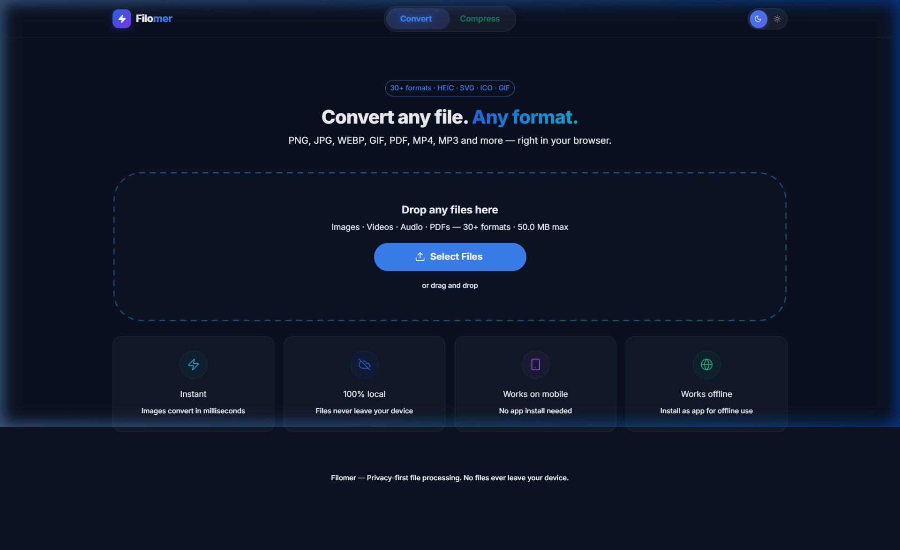
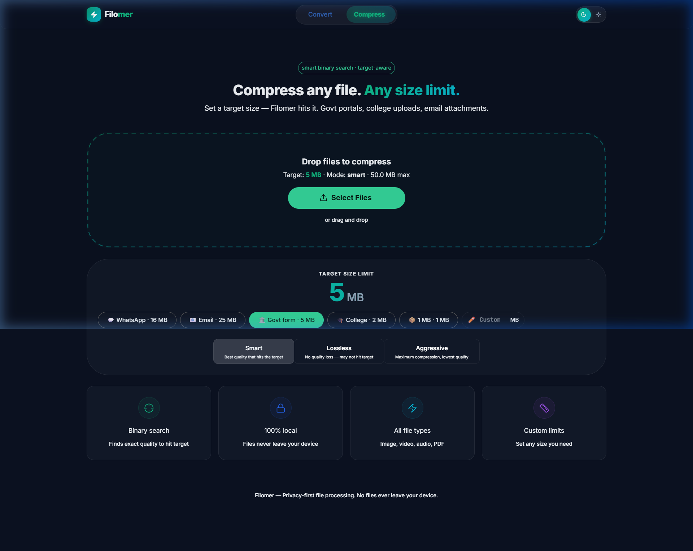

<p align="center">
  
</p>

<h1 align="center">Filomer</h1>

<p align="center">
  <strong>A privacy-first file converter & compressor that runs entirely in your browser.</strong><br/>
  No uploads. No server. No file size tracking. 100% client-side.
</p>

<p align="center">
  
  
  
  
  
</p>

---

## What is Filomer?

Filomer is a **browser-based file processing tool** that converts and compresses files across **30+ formats** — images, videos, audio, PDFs, SVGs, and more — without ever uploading your files anywhere.

- 🖼️ **Image conversion** — PNG, JPG, WEBP, GIF, BMP, AVIF, ICO, HEIC, SVG, TIFF
- 🎬 **Video conversion** — MP4, WEBM, AVI, MOV, MKV, FLV, 3GP + extract audio
- 🎵 **Audio conversion** — MP3, WAV, OGG, AAC, FLAC, M4A, OPUS
- 📄 **PDF operations** — PDF → images, images → PDF, merge multiple PDFs
- 📦 **Smart compression** — Binary search algorithm to hit exact file size targets (WhatsApp, email, govt forms)

### Screenshots

<p align="center">
  
  <br/>
  <em>File Converter — 30+ format support with instant preview</em>
</p>

<p align="center">
  
  <br/>
  <em>Smart Compressor — binary search to hit exact file size targets</em>
</p>

---

## Key Features

| Feature | Details |
|---------|---------|
| 🔒 **100% Private** | Files never leave your device — all processing happens in-browser |
| ⚡ **Instant for images** | Canvas API for image conversions — millisecond processing, zero network |
| 🎬 **Video & Audio** | FFmpeg.wasm loads silently on-demand for heavy formats (no popup, no banner) |
| 📲 **Installable PWA** | Works offline as a desktop/mobile app with one click |
| 🎯 **Target-size compression** | Set a target (e.g., 5MB for govt portal) and the binary search algorithm finds optimal quality |
| 📥 **Auto-download** | Converted/compressed files automatically save to your Downloads folder |
| 🚫 **No popups** | Zero modals, zero banners — drop files and get results |
| 🌙 **Dark/Light mode** | Premium glassmorphic UI with smooth theme transitions |
| 📱 **Fully responsive** | Works on desktop, tablet, and mobile browsers |
| 🗂️ **Batch processing** | Drop multiple files, convert/compress all at once, ZIP output |

---

## Tech Stack

| Layer | Technology | Why |
|-------|-----------|-----|
| **Framework** | React 19 | Latest features, fast renders |
| **UI Library** | MUI v9 (Material UI) | Premium component system with theme support |
| **Build Tool** | Vite 8 | Sub-second HMR, fast builds |
| **Image Processing** | Canvas API (built-in) | Zero-dependency, instant image conversion |
| **Video/Audio** | FFmpeg.wasm | Full codec support, runs in-browser via WebAssembly |
| **PDF** | pdf-lib + pdfjs-dist | Create, parse, merge, and render PDFs |
| **HEIC** | heic2any | iPhone photo format support |
| **Icons** | Lucide React | Clean, consistent icon set |
| **Routing** | React Router v7 | Client-side SPA routing |
| **Bundling** | JSZip | Client-side ZIP creation for batch downloads |
| **Hosting** | Cloudflare Pages | Free tier, global CDN, automatic deploys |

---

## Architecture

```
src/
├── FileConverter.jsx        # Main converter page — drop zone, file grid, options panel
├── Compressor.jsx           # Smart compressor page — target size, presets, modes
├── conversionEngine.js      # Core conversion router — Canvas API + FFmpeg.wasm
├── compressionEngine.js     # Binary search compression — hit exact file size targets
├── theme.js                 # MUI v9 theme — dark/light, CSS variables
├── main.jsx                 # App entry — router, theme provider
│
├── components/
│   ├── Layout.jsx           # App shell — glassmorphic AppBar, nav pills, theme toggle
│   ├── DropZone.jsx         # Drag & drop zone with marching ants SVG animation
│   ├── FileCard.jsx         # File thumbnail card — preview, progress, status
│   ├── CompressCard.jsx     # Compression result card — before/after size comparison
│   ├── OptionsPanel.jsx     # Format picker, quality slider, resize, actions
│   ├── ActionBar.jsx        # Floating batch action bar + PWA install button
│   └── Toast.jsx            # Toast notification system
│
├── hooks/
│   └── usePWA.js            # PWA install prompt management
│
└── styles/
    ├── design-system.css    # CSS custom properties — colors, spacing, elevation
    ├── components.css       # Component styles
    └── animations.css       # Keyframes, transitions, stagger utilities
```

### Processing Flow

```
User drops file
       │
       ▼
  ┌─────────────────┐
  │  getCategory()  │  ← Checks file extension
  │  validate size  │  ← 50MB hard cap
  └────────┬────────┘
           │
     ┌─────┴─────┐
     │           │
  image/svg   video/audio/heic
     │           │
     ▼           ▼
  Canvas API   FFmpeg.wasm
  (instant)    (auto-loaded silently)
     │           │
     ▼           ▼
  Auto-download to user's device
```

### Unsupported Files

Filomer only accepts files it can actually process. Unsupported formats like `.docx`, `.xlsx`, `.pptx`, etc.:
- **File picker**: Only shows supported file types (filtered via `accept` attribute)
- **Drag & drop**: Shows an error toast: "Unsupported format: document.docx"

---

## Getting Started

### Prerequisites
- Node.js 18+
- npm or yarn

### Installation

```bash
git clone https://github.com/YOUR_USERNAME/filomer.git
cd filomer
npm install
```

### Development

```bash
npm run dev
```

Opens at `http://localhost:5173`

### Production Build

```bash
npm run build
npm run preview
```

### Deploy to Cloudflare Pages

1. Push to GitHub
2. Connect repo to [Cloudflare Pages](https://pages.cloudflare.com)
3. Set build command: `npm run build`
4. Set output directory: `dist`
5. Deploy — done!

---

## Supported Formats

### Converter

| Input | Output Options |
|-------|---------------|
| PNG, JPG, WEBP, GIF, BMP, TIFF, AVIF, ICO | PNG, JPG, WEBP, GIF, BMP, AVIF, ICO, PDF |
| SVG | PNG, JPG, WEBP, PDF |
| HEIC, HEIF | JPG, PNG, WEBP |
| PDF | PNG, JPG, WEBP, ZIP (all pages) |
| MP4, MKV, MOV, AVI, WEBM, FLV, 3GP | MP4, WEBM, AVI, MOV, GIF, MP3, WAV, AAC |
| MP3, WAV, OGG, AAC, FLAC, M4A, OPUS | MP3, WAV, OGG, AAC, FLAC, M4A |

### Compressor

| File Type | Method |
|-----------|--------|
| Images | Canvas API quality binary search |
| Video | FFmpeg.wasm bitrate reduction |
| Audio | FFmpeg.wasm bitrate reduction |
| PDF | Image recompression via pdf-lib |

### Compression Presets

| Preset | Target Size | Use Case |
|--------|-------------|----------|
| 💬 WhatsApp | 16 MB | Media sharing limit |
| 📧 Email | 25 MB | Attachment limit |
| 🏛️ Govt Form | 5 MB | Portal upload limit |
| 🎓 College | 2 MB | Submission limit |
| 📦 Tight | 1 MB | Minimum size |
| ✏️ Custom | Any | Your own limit |

---

## Design Decisions

- **No cloud processing**: Cloudflare Workers free tier has a 10ms CPU limit — not viable for file conversion. Everything runs client-side instead.
- **No engine popup**: FFmpeg.wasm (~30MB) loads silently in the background when a user drops a video/audio file. The file card shows "Preparing…" then transitions to converting. No modal, no banner, no user action needed.
- **Canvas API first**: Image conversions use the browser's built-in Canvas API — zero dependency, instant processing, works offline.
- **Auto-download**: Files save immediately after conversion. No manual "download" click needed.
- **50MB file cap**: Keeps browser memory usage reasonable. Files over 50MB are rejected with a toast message.

---

## License

MIT

---

<p align="center">
  Built with ❤️ for fast, private, offline-first file processing.
</p>
